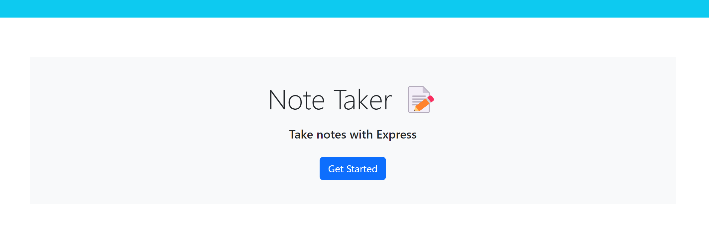
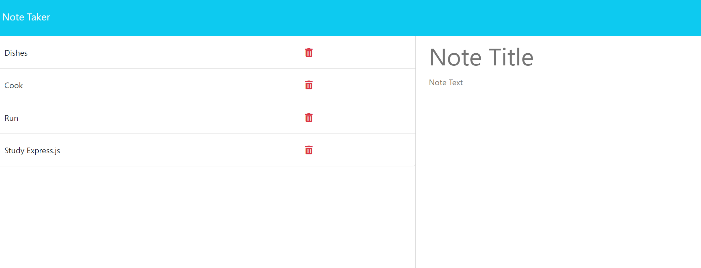

# Note Taker Starter Code

## Motivation
This project exists to build the backend of a note taker application that allows a user to create new notes, and have them persist to the UI using express.js.

## Screenshots

## Tech/framework used
Javascript, Express.js, Node.js, Heroku.

## Deployed application link
Deplyed application: https://fast-stream-75447-f98f1ef26d11.herokuapp.com/

## Usage
From the homepage, slect the 'Get Started' button to naviagate to the notes page. There, you can view your existing notes, as well as add additoinal notes by filling in the fields in the right hand column and selecting "Save Note" after. Refresh your page to confirm it saved.

## License
MIT © [nicanthoni]()